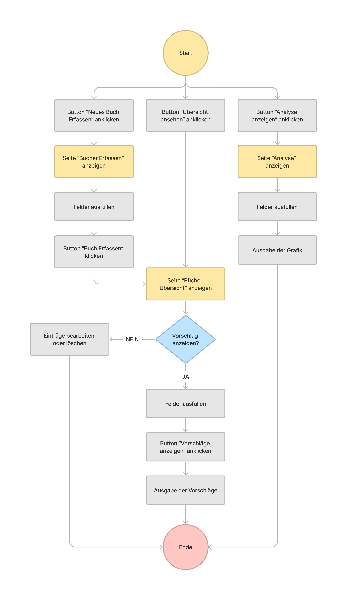

# Bücherverwaltung 
## 1. Problembeschreibung
Aktuell erfasse ich meine gelesenen Bücher handschriftlich. Welches recht mühsam ist, wenn man eine Änderung machen will.
## 2. Projektidee
Mithilfe der Webapplikation, möchte ich eine gute Übersicht von meinen Büchern erschaffen. Ich möchte bereits gelesene Bücher erfassen und die Bücher filtern können. Ebenfalls möchte ich Statistiken über die gelesenen Büchern kreieren. 
## 3. Workflow

## 4. Programmübersicht
### 4.1 Erfassen
Hier kann der User ein neues Buch erfassen.
- Folgende Daten werden dafür benötigt: 
    - Titel (Text)
    - Author (Text)
    - Genre (Auswahl)
      - Fantasy
      - Thriller
      - Sci-Fi
      - Dystopian
      - Non-Fiction
    - Bewertung (Zahl)
- Die Eingabe kann mit dem Button "Buch erfassen" gespeichert werden. 
  - Falls eine Feld nicht ausgefüllt wird, erscheint eine Fehlermeldung.
  - Bei der Bewertung, muss eine Zahl grösser als 1 sein. Ansonsten erscheint wiederum eine Fehlermeldung.
### 4.2 Abfrage
Hier bereits erfasste Bücher für den User gefiltert.
- Folgende Daten werden dafür benötigt:
  - Titel (Text)
  - Author (Text)
  - Genre (Auswahl)
    - Fantasy
    - Thriller
    - Sci-Fi
    - Dystopian
    - Non-Fiction
  - Bewertung (Zahl)
- Nachdem der User den Button "Vorschläge anzeigen" ausgewählt hat, werden die Angaben des Users mit bereits Erfassten Einträgen in der Datenbank verglichen.
  - Wenn man bei Titel, Author und Bewertung nichts spezifisches Suchen möchte, kann man das Eingabefeld leer lassen.
### 4.3 Übersicht
- Hier kann man die bereits gelesenen Bücher anschauen. Bei Bedarf können diese wieder gelöscht oder bearbeitet werden.
## 5. Funktionen 
- Dateneingabe: neues Buch erfassen, Abfrage für ein Büchervorschlag
- Datenspeicherung: mögliche Büchervorschläge und bereits gelesene Bücher werden in JSON-Datei gespeichert
- Datenverarbeitung: Abfrage wird mittels For-Schleife mit der Datenbank Bücher verglichen, Berechnung der gesamten Bücher
- Datenausgabe: Ausgabe der Büchervorschlägen, Ausgabe der gespeicherten Bücher, Balkendiagramm mit Plotly
## 6. Mögliche zukünftige Erweiterungen des Programms
Die Applikation könnte mit den folgenden Ideen erweitert werden:
- Grafische Darstellung von allen erfassten Büchern 
- Die Seitenanzahl von gelesenen Büchern zusammenzählen
- Anzahl erfasste Bücher zusammenzählen
- Grössere Auswahl von den Genres 
- Nicht nur gelesene Bücher erfassen sondern auch "Currently Reading" und "To Be Read" integrieren.
- Bewertungen farbig machen (z.B Rot = 1, schlecht)
- Allgemein schöner gestalten (z.B cooler Hintergrund, Schriftarten, Farben etc.)
